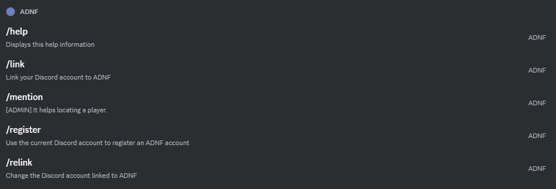

# ADNF Discord Gateway

Follow these instructions after deploying this repo on Cyclic.sh

[](https://deploy.cyclic.app/)


## Set-up and configuration

### **1.** Create discord application

Navigate to Discord's developer portal and create a new application
 - https://discord.com/developers/applications

<p align="center">
    
</p>

### **2.** Get application keys and parameters
After creating the application, you are taken to the application's dashboard. There you can configure an app icon, description, etc. 

Retrieve:
- `APPLICATION ID` (Discord also calls this `CLIENT ID`)
- `PUBLIC KEY`

Configure your Cyclic App with these environment variables.

<p align="center">
    
</p>

### **3.** Enable the Bot in the application
On the left hand side, go to `Bot` then click on `Add Bot`

You will need to create the bot token. 
Press `Reset Token` and confirm.
<p align="center">
    
</p>


Retrieve the `TOKEN` string and configure your Cyclic App with this environment variable.

### **4.** Adding the bot to your server
The easiest way to add the bot to your server is via url. 

Go to `OAuth2` > `URL Generator` on the left, select the permissions:
- `applications.commands` - allows you to register slash commands
- `bot` - this will show additional permissions for the bot
  - `Send Messages` - to allow the bot to send messages 

<p align="center">
    
</p>

Copy and navigate to the generated URL at the bottom. 

The page will ask you to select a server to install your bot on, it will go through a few prompts to verify that you are human. 

<p align="center">
    
</p>

After you authorize, the bot will appear in your server.
<p align="center">
    
</p>

**Keep in mind, the bot does not yet have any code running, so it will not do anything just yet**


### **5.** Get your Server ID
To get the server id (Discord also calls this GUILD ID), you first have to enable developer mode for in your discord user settings > advanced:
<p align="center">
    
</p>

With developer mode on, you will be able to right click the discord server name to copy it's id:
<p align="center">
    
</p>

Developer mode allows you to right click all kinds of things in discord to get their id's (channels, users, messages, etc.)


## **6.** Set up environment variables
At this point, make sure you've collected all the variables you will use in your environment
- CLIENT_ID (same as Application ID)
- PUBLIC_KEY
- TOKEN
- GUILD_ID (same as Server ID)

<p align="center">
    
</p>

## **6.1** Alternatively, duplicate .env.example and rename it to .env
(Optional) Append line:
```
PORT=<PORT_NUMBER>
```
e.g. The default port for this application: 
```
PORT=3131
```

# Set up interactions endpoint
**This step is VERY IMPORTANT**, it lets discord know the url at which the bot is running. Discord will send interaction event payloads to this endpoint.

<p align="center">
    
</p>

When you first enter the endpoint into the ui, discord will make a cryptographically signed request to your endpoint and expect you to verify the signature. This will establish trust between discord and your hosted bot.

1. Make sure your bot is deployed to Cyclic
2. Before entering the endpoint **make sure** the environment variables have been properly configured and that `process.env.PUBLIC_KEY` is set.
3. Enter the your Cyclic App url as the endpoint url into discord and Save Changes (eg `https://[your bot's url].cyclic.app/interactions`)

- The `/interactions` endpoint is using the `verifyKeyMiddleware` function to verify the keys automatically

```js
app.post('/interactions', verifyKeyMiddleware(PUBLIC_KEY), async (req, res) => {
    ...
```

# Setup a reverse proxy to enable HTTPS (for self-hosters)
TODO

# Configure your DNF gateway api interactions
1. Make sure all of the environment variables have been correctly set up
2. Go to `https://[your bot's cyclic url].cyclic.app/register_commands` or `https://[your bot's url]/register_commands`
   This route makes a put request to register all commands needed for DNF account operations.
        ```
        app.get('/register_commands', async (req,res) => {
        ```
        ```
        const slash_commands = [
        ```

Refer to the [discord docs](https://discord.com/developers/docs/interactions/application-commands#bulk-overwrite-guild-application-commands) to extend this further 

After registering commands, you should see them available in your discord server

<p align="center">
    
</p>

# Try the bot!

In any channel type `/` for a list of commands, and register an account:

```
/register username:abc123 password:123456
```

